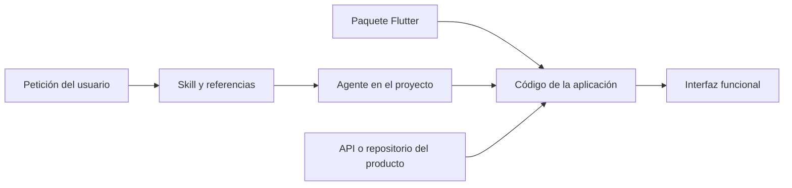

# Qué son Issel Code Widgets y su skill

## El paquete

`issel_code_widgets` es un paquete Flutter de Issel Code que aporta controles visuales y mecanismos compartidos para construir aplicaciones. Incluye botones, campos de formulario, selectores, tarjetas, información, tablas, carrusel, cargas y piezas para escritorio. También ofrece configuración centralizada, tema claro/oscuro/sistema, navegación basada en `Navigator` y resultados tipados para datos y dominio.

Los controles leen `Theme.of(context)`, por lo que puedes utilizar los temas del paquete o integrarlos con el tema de una aplicación existente. El código del paquete se encuentra en `lib/`; el catálogo principal se importa desde:

```dart
import 'package:issel_code_widgets/issel_code_widgets.dart';
```

Sirve para reducir trabajo repetido en interfaces de administración, formularios, configuración, selección de opciones y herramientas de escritorio. La app aporta datos, reglas de negocio, permisos, autenticación y persistencia.

## La skill

`issel-code-widgets` es un conjunto de instrucciones y referencias para que un agente construya interfaces usando el paquete y sus convenciones. Su nombre lleva guiones; el nombre de la dependencia Dart lleva guiones bajos.

La skill describe cómo revisar el proyecto, elegir componentes, distribuir responsabilidades por features, integrar datos, componer el tema y comprobar la interfaz. Está formada por `SKILL.md`, `agents/openai.yaml` y cinco referencias. Es una guía de implementación que el agente lee al trabajar; no se importa desde Dart ni se ejecuta dentro de la aplicación Flutter.

## Cómo se complementan

| Aspecto | Paquete `issel_code_widgets` | Skill `issel-code-widgets` |
| --- | --- | --- |
| Usuario directo | Código de la app Flutter. | Agente que trabaja en el proyecto. |
| Instalación | Dependencia en `pubspec.yaml`. | Carpeta de skill reconocida por el entorno. |
| Entrada | Constructores, propiedades y callbacks. | Petición en lenguaje natural y archivos del proyecto. |
| Resultado | Widgets y tipos que la app utiliza en ejecución. | Cambios de código siguiendo las convenciones descritas. |
| Configuración | `IsselAppConfig` y configuraciones de tema/escritorio. | Instrucciones y referencias de la skill. |
| Distribución actual revisada | Repositorio GitHub del paquete. | Carpeta instalada fuera de este repositorio. |



Puedes programar directamente con el paquete sin usar la skill. Cuando trabajas con la skill en una app nueva, ésta establece la estructura por features y concentra los defaults en `AppIsselController`. En una app con arquitectura, router y gestor de estado adoptados, conserva esas decisiones y adapta la funcionalidad solicitada.

## Qué encontrarás en el kit

| Necesidad | Solución habitual |
| --- | --- |
| Confirmar una acción | `IsselButton`. |
| Capturar y validar texto | `IsselTextFormField`. |
| Elegir entre pocas opciones | `IsselDropdown`, `IsselDropdown2`. |
| Buscar una opción | `IsselSearchDropdown` y filtrado implementado por la app. |
| Cambiar un estado o cantidad | `IsselToggleField`, `IsselStepperField`. |
| Mostrar filtros o dos modos | `IsselFilterBar`, `IsselTabSwitcher`. |
| Mostrar datos y estados breves | `IsselInfoField`, `IsselInfoField2`, `IsselPill`. |
| Seleccionar imágenes | `IsselImagePicker`. |
| Mostrar resultados | `IsselTableWidget` o un listado compuesto por la app. |
| Esperar una operación | `IsselShimmer`, `IsselCircularProgressIndicator`. |
| Componer escritorio | `IsselDesktopScaffold`, caption, pane y breadcrumbs. |
| Cambiar apariencia | `IsselAppController`, `IsselThemeController`, `IsselThemeSelector`. |
| Comunicar éxito o fallo | `AppResult<T>`, `AppFailure`, `AppException`. |

Elige los widgets según la interacción. Flutter estándar sigue siendo apropiado para layout, scroll, diálogos y controles que el kit no cubre. La [referencia](../../../../../Desktop/issel_code_widgets/docs/referencia/README.md) explica todos los componentes y sus diferencias.

## Primer recorrido sugerido

Instala la dependencia, ejecuta la [primera app](../../../../../Desktop/issel_code_widgets/docs/ejemplos/01-primera-app.md), cambia el tema y prueba un formulario. Después revisa la [skill](03-uso-de-la-skill.md) para describir una vista y sus datos. El [formulario de clientes](../../../../../Desktop/issel_code_widgets/docs/ejemplos/02-formulario-clientes.md) muestra cómo conectar esas piezas en una feature completa.
