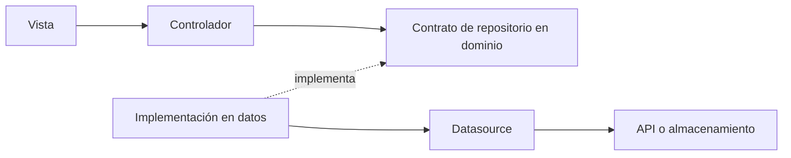

# Arquitectura por features

## Separar responsabilidades

La skill utiliza el perfil `feature` en apps nuevas. Cada funcionalidad reúne presentación, dominio y datos. Presentación sigue MVVM: la vista compone la interfaz y el controlador mantiene estado observable y coordina acciones. Una app existente conserva su estructura y gestor de estado; el esqueleto de `flutter create` necesita todavía establecer estas responsabilidades.

```text
lib/
  main.dart
  inject_container.dart                 # Sólo si existe composición que resolver.
  core/
    app/app.dart                       # Raíz, tema y composición del producto.
    services/                          # Cliente API o feedback transversal real.
  commons/
    widgets/                           # Piezas compartidas entre features.
    dialogs/
  src/
    issel/
      presentation/controllers/app_issel_controller.dart
    customers/
      domain/
        entities/customer.dart
        repositories/customer_repository.dart
      data/
        repositories/customer_repository_impl.dart
        datasources/                   # Cuando hay una fuente externa.
        models/                        # DTO y conversión si hay formato externo.
      presentation/
        controllers/customers_controller.dart
        views/customers_view.dart
        widgets/
        dialogs/
```

Crea sólo las carpetas con una responsabilidad efectiva. Un splash estático puede necesitar únicamente su vista. Un repositorio en memoria no necesita un DTO ni fuentes remota/local ficticias. `main.dart` inicializa dependencias y arranca la app; la composición global y las vistas tienen sus propios archivos.



Las flechas de llamada y las dependencias de código son conceptos distintos: el controlador utiliza un contrato de dominio; la implementación en datos también depende de ese contrato. El dominio no importa widgets, Flutter, navegación, SDK HTTP/Firebase ni implementaciones de datos.

## Ubicar cada pieza

| Pieza | Capa | Motivo |
| --- | --- | --- |
| `CustomerEntity`, borrador y reglas del producto | Dominio. | Describen el producto sin formato técnico. |
| Contrato `CustomerRepository` | Dominio. | Capacidades que necesita la feature. |
| JSON, DTO, códigos HTTP o excepciones del SDK | Datos. | Traducción del sistema externo. |
| Implementación del repositorio | Datos. | Conversión a entidades y fallos esperados. |
| Carga, selección, lista y guardado | Controlador de presentación. | Estado que observa la pantalla. |
| `TextEditingController`, layout y validación de formato | Presentación. | Interacción con Flutter. |
| Navegar, cerrar diálogo o mostrar confirmación | Callback de la vista. | Efecto puntual de la interacción. |
| Defaults de tema, título y escritorio | Feature Issel/composición. | Configuración compartida del kit. |

En dominio y datos usa `issel_core.dart`; en presentación utiliza el barrel de widgets. Las carpetas por sí solas no garantizan límites: revisa también imports y tipos de retorno.

## Contratos de datos

Lee los métodos y parámetros del servicio real antes de conectarlo. Separa la petición, la respuesta y los envoltorios de transporte. Un `id` generado por el servidor pertenece a la respuesta, y sólo debe enviarse si el contrato de creación lo admite. Los DTO convierten JSON a entidades mediante composición o mappers, sin herencia que duplique todos los campos por costumbre.

Para Firebase, el datasource encapsula el SDK y convierte fallos conocidos a `AppException` o directamente a `AppFailure`; el contrato devuelve la entidad de sesión de la app. Una UI de demostración puede usar un repositorio en memoria que implemente el mismo contrato. Identifica esa fuente en la documentación y reemplázala en composición cuando exista un backend real.

El kit no incluye cliente HTTP, repositorios de clientes, autenticación, servicios de toast ni infraestructura de persistencia. Los nombres de estos ejemplos pertenecen a la app.

## Resultado de operación

`AppResult<T>` distingue un éxito con valor de un fallo esperado. No equivale al estado completo de la pantalla:

```dart
// En un archivo de datos/dominio:
import 'package:issel_code_widgets/issel_core.dart';

Future<AppResult<String>> loadName(Future<String> Function() fetch) async {
  try {
    return AppResult.success(await fetch());
  } on AppException catch (exception) {
    return AppResult.error(AppFailure.fromException(exception));
  }
}
```

El mensaje del fallo es apto para UI. `cause` y `stackTrace` conservan el diagnóstico. La app define códigos como `connection`, `credentials` o `operation_in_progress`. Evita capturar errores de programación indiscriminadamente para convertirlos en fallos de negocio.

La vista consume el resultado una sola vez después de una acción:

```dart
// Dentro del callback de una vista montada:
final result = await controller.createCustomer(draft);
if (!mounted) return;

switch (result) {
  case AppSuccess<CustomerEntity>(:final value):
    ScaffoldMessenger.of(context).showSnackBar(
      SnackBar(content: Text('Cliente ${value.name} creado')),
    );
  case AppError<CustomerEntity>(:final failure):
    ScaffoldMessenger.of(context).showSnackBar(
      SnackBar(content: Text(failure.message)),
    );
}
```

Este fragmento requiere los tipos y el controlador del [ejemplo de clientes](../../../../../Desktop/issel_code_widgets/docs/ejemplos/02-formulario-clientes.md). Los efectos no se ejecutan desde `build` ni se guardan como eventos que se repitan en cada reconstrucción.

## Ciclo de vida y concurrencia

Un controlador nuevo extiende `IsselController`. Después de un `await`, comprueba `isDisposed` antes de mutar o notificar, incluso en `catch` y `finally`. La vista comprueba `mounted` por separado antes de usar contexto. El guardado puede terminar aunque la pantalla se haya cerrado; evitar notificaciones no cancela una petición ni deshace una escritura remota.

Protege el envío con `isSaving` en el controlador y deshabilita la acción en la vista. Para búsquedas simultáneas usa un identificador de petición y descarta resultados antiguos; bloquear el guardado no resuelve ese problema. Libera streams, timers y recursos antes de `super.dispose()` y define un único dueño de cada controlador. Los controladores de pantalla suelen vivir lo que vive su pantalla; tema y sesión pueden ser globales cuando esté justificado.

## Evolucionar a `full`

| Perfil | Utilizar cuando | Cambios |
| --- | --- | --- |
| `feature` | Presentación puede coordinar las capacidades del repositorio directamente. | Vista, controlador, contrato, entidades y datos efectivos. |
| `full` | Hay reglas compartidas, coordinación de varias operaciones, caché o sincronización. | Casos de uso y separación de fuentes según la necesidad. |

Un caso de uso recibe contratos y valores Dart y devuelve entidades o resultados. Por ejemplo, `CreateSale` puede validar crédito y coordinar una creación, y `PrintSaleTicket` puede reunir datos para impresión. No necesitas un caso de uso por método trivial, una clase genérica obligatoria ni `NoParams`.

La evolución se decide por responsabilidades, no por número de pantallas. Ambas variantes conservan el contrato que recibe la vista. Esta separación es compatible con las [recomendaciones oficiales de arquitectura de Flutter](https://docs.flutter.dev/app-architecture/recommendations), que tratan la capa de dominio adicional según complejidad.

## Dividir las vistas

Extrae piezas con responsabilidad visual propia a `src/<feature>/presentation/widgets/`: filtros, listado, resumen o bloque de error. Usa nombres del producto como `CustomerFilters` o `CustomerSummary`. Lleva una pieza a `commons` cuando realmente la compartan varias features.

En un `State`, coloca campos y getters, métodos de ciclo de vida, `build` y después callbacks/auxiliares. Una vista pequeña puede permanecer en un archivo; no es necesario extraer cada `Row` o `Text`. La feature de ejemplo demuestra cómo conservar estos límites sin añadir un gestor de estado externo.
