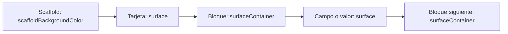

## Un punto de configuración

En una app nueva crea `AppIsselController extends IsselAppController` en `lib/src/issel/presentation/controllers/app_issel_controller.dart`. Su constructor establece un `IsselAppConfig` explícito con título, variantes clara/oscura y modo inicial. La [primera app](/ejemplos/primera-app) incluye el archivo completo y una fachada `configure(...)` para actualizarlo durante la ejecución.

`IsselAppController` mantiene una instancia estable de `.theme` y otra de `.navigation`. La raíz escucha al controlador con `AnimatedBuilder` y construye `MaterialApp` con:

```dart
// Dentro del builder de la raíz; app es AppIsselController:
MaterialApp(
  title: app.config.title,
  theme: app.theme.lightTheme,
  darkTheme: app.theme.darkTheme,
  themeMode: app.theme.themeMode,
  navigatorKey: app.navigation.navigatorKey,
  home: const HomeView(),
)
```

El dueño crea el controlador una vez y lo libera en `dispose`. No construyas controladores nuevos dentro de `build` ni sustituyas tema/navegación para cambiar un color. `updateConfig(config.copyWith(...))` aplica cambios y mantiene esas identidades. Cambiar el tema desde `.theme` también sincroniza `.config`.

## Configuraciones disponibles

| Tipo | Contenido |
| --- | --- |
| `IsselAppConfig` | Título, tema claro, tema oscuro, modo y medidas de escritorio. |
| `IsselThemeConfig` | Paleta, tipografía, radio de list tiles y radio de cards. |
| `IsselThemeColors` | Roles semánticos y `brightness`. |
| `IsselTextThemeConfig` | Familia, escala global y altura por variante tipográfica. |
| `IsselDesktopConfig` | Ancho de sidebar, altura de caption, breakpoint y duración. |

Todos estos valores se pueden copiar con `copyWith`. Son configuraciones inmutables; lo mutable es la configuración efectiva que conserva y actualiza el controlador.

## Colores predeterminados

| Rol | Claro | Oscuro |
| --- | --- | --- |
| `scaffoldBackground` | `#E5ECF4` | `#0F101B` |
| `surface` | `#F6F8FA` | `#272832` |
| `surfaceContainer` | `#E5ECF4` | `#0F101B` |
| `primary` | `#0F52FF` | `#0046FF` |
| `onPrimary` | `#FFFFFF` | `#FFFFFF` con alfa `D3`. |
| `secondary` | `#1A3A9F` | `#1A3A9F` |
| `onSecondary` | `#000000` | Blanco con alfa `D3`. |
| `onSurface` | `#000000` | Blanco con alfa `D3`. |
| `outline` | `#727385` | `#727385` |
| `error` | `Colors.red` (`#F44336`) | Igual. |
| `onError` | `#000000` | Blanco con alfa `D3`. |
| `primaryContainer` | `#FFFFFF` | `#272832` |
| `onPrimaryContainer` | `#FFFFFF` | Blanco con alfa `D3`. |
| `outlineVariant` | Generado por `ColorScheme.fromSeed` si no se configura. | Igual criterio. |

Éstos son los defaults del código revisado, no colores que debas repartir por widgets. `colorScheme` parte de `ColorScheme.fromSeed` y sobreescribe los roles configurados. Al personalizar comprueba pares fondo/texto, especialmente roles cuyo contraste no hayas utilizado antes.

## Alternar superficies



En el contrato visual de la skill, `surfaceContainer` comparte color con el fondo del Scaffold. La profundidad surge al alternar las dos superficies. Una capa `surfaceContainer` directamente sobre el Scaffold se funde con él; dos capas consecutivas `surface` tampoco contrastan.

Por ejemplo, dentro de una tarjeta principal `surface`:

```dart
// Dentro de build, colors = Theme.of(context).colorScheme:
IsselInfoField(
  title: 'Pedidos pendientes',
  value: '12',
  backColor: colors.surfaceContainer,
  valueBackColor: colors.surface,
)
```

Un widget Issel no identifica automáticamente su profundidad en el layout. Si sus defaults corresponden a otra capa, configura sus propiedades de color. Para esta jerarquía usa `scaffoldBackgroundColor`, `surface` y `surfaceContainer`; la skill revisada no introduce `surfaceContainerHighest` ni otras variantes. Utiliza `primary/onPrimary` para selección y acciones, `onSurface` para contenido y `outline` para información auxiliar.

El constructor de la paleta permite colores arbitrarios, por lo que técnicamente puedes separar fondo y `surfaceContainer`. Al trabajar con esta skill, conserva su contrato de dos superficies y modifica ambos roles juntos si cambias el fondo.

## Cambiar la marca y el fondo

```dart
// Usando la fachada de la primera app:
app.updateLightColors(
  app.config.lightTheme.colors.copyWith(
    primary: const Color(0xff7B1FA2),
    onPrimary: Colors.white,
  ),
);

final dark = app.config.darkTheme.colors;
app.updateDarkColors(dark.copyWith(
  scaffoldBackground: const Color(0xff15151D),
  surfaceContainer: const Color(0xff15151D),
));
```

Estos literales son overrides de marca concentrados en configuración. Las vistas siguen leyendo tokens del tema.

## Modo y edición de paletas

`ThemeMode.system` selecciona el brillo del sistema; `light` y `dark` fuerzan una variante. `IsselThemeSelector(controller: app.theme)` muestra las tres opciones, actualiza el controlador y después llama `onChanged`. La persistencia de esa selección pertenece a la app.

La regla de edición compartida de la skill es una política para tu fachada, no un comportamiento automático de `IsselThemeController`:

| Modo activo del editor | Destino de una edición de rol o escala |
| --- | --- |
| `system` | Copiar el cambio a ambas variantes. |
| `light` | Cambiar sólo la variante clara. |
| `dark` | Cambiar sólo la variante oscura. |

Parte de cada paleta y cambia sólo el rol editado; conserva su `brightness` y los demás colores. La fachada de la primera app implementa `setPrimaryForCurrentMode` y `setTextScaleForCurrentMode` siguiendo ese criterio. `theme.updateLightColors` por sí mismo cambia únicamente la variante clara, incluso si el modo es sistema.

## Tipografía

| Variantes | Tamaños base en px lógicos |
| --- | --- |
| `displayLarge`, `displayMedium`, `displaySmall` | 44, 40, 36. |
| `headlineLarge`, `headlineMedium`, `headlineSmall` | 34, 31, 28. |
| `titleLarge`, `titleMedium`, `titleSmall` | 25, 20, 18. |
| `bodyLarge`, `bodyMedium`, `bodySmall` | 17, 15, 13. |
| `labelLarge`, `labelMedium`, `labelSmall` | 13, 12, 11. |

Todas las alturas parten de `1.0` y `fontSizeScale` de `1.0`. Los labels reciben el color `outline`; los demás textos utilizan `onSurface`. Puedes aumentar interlineado o escala sin reemplazar la paleta:

```dart
app.updateLightText(app.config.lightTheme.text.copyWith(
  fontSizeScale: 1.1,
  bodyMediumHeight: 1.25,
));
```

La escala del tema es independiente de la escala accesible del sistema. Comprueba ambas en pantallas con alturas fijas. `fontFamily` exige registrar o proporcionar la fuente en la app; el paquete no incluye fuentes descargables. Los `copyWith` que usan `??` conservan la familia si reciben `null`; para quitarla, crea un `IsselTextThemeConfig` nuevo manteniendo los otros valores necesarios.

## Formas, espaciado y encabezados

La mayoría de controles fijan radios de `10`; la imagen utiliza `18`, el pane `16` y las acciones compactas `6`. `IsselThemeConfig.borderRadius` afecta a list tiles y `cardBorderRadius` a cards Material. Cambiarlos no modifica los radios fijos de todos los widgets Issel.

Los controles de una línea suelen medir `50`, y botón/texto `60`. Utiliza separación consistente —por ejemplo 12 entre campos y 20–24 entre secciones—, ajustándola a la tarea. Un encabezado de título y descripción se resuelve con texto y espacio; añade iconos cuando comuniquen acción, estado o categoría útil. Si AppBar o breadcrumbs ya identifican la tarea, evita repetir ese título.

En una composición amplia, alinea las alturas de tarjetas hermanas con `IntrinsicHeight` y `CrossAxisAlignment.stretch` o restricciones equivalentes. Al apilarlas deja altura natural. Los [componentes reutilizables](/ejemplos/componentes-reutilizables) incluyen una página que centra contenido breve en escritorio y permite desplazamiento en móvil sin contar dos veces el padding vertical.
